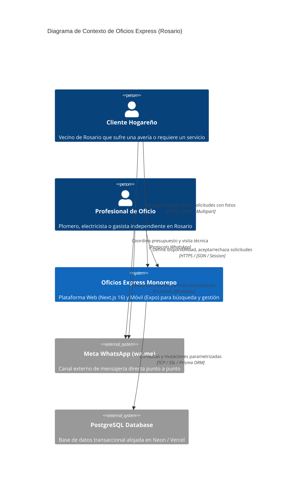
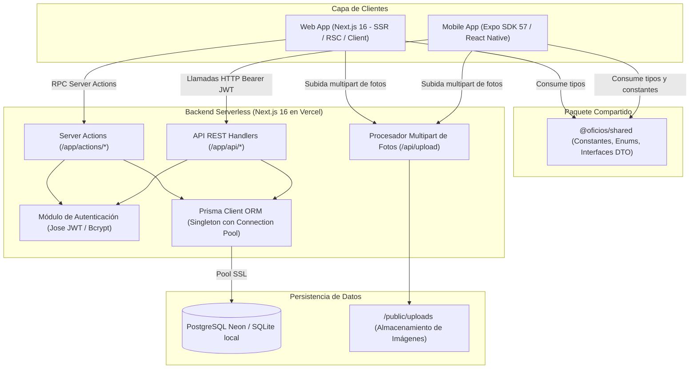
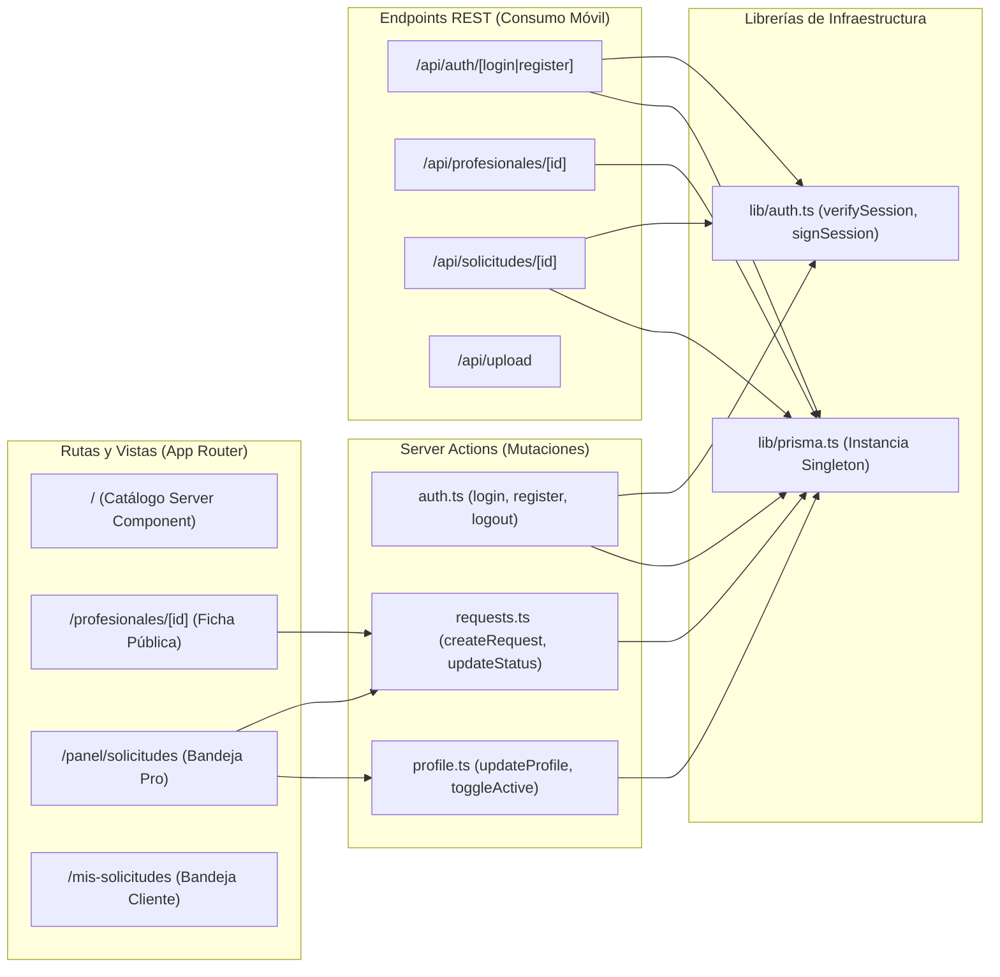
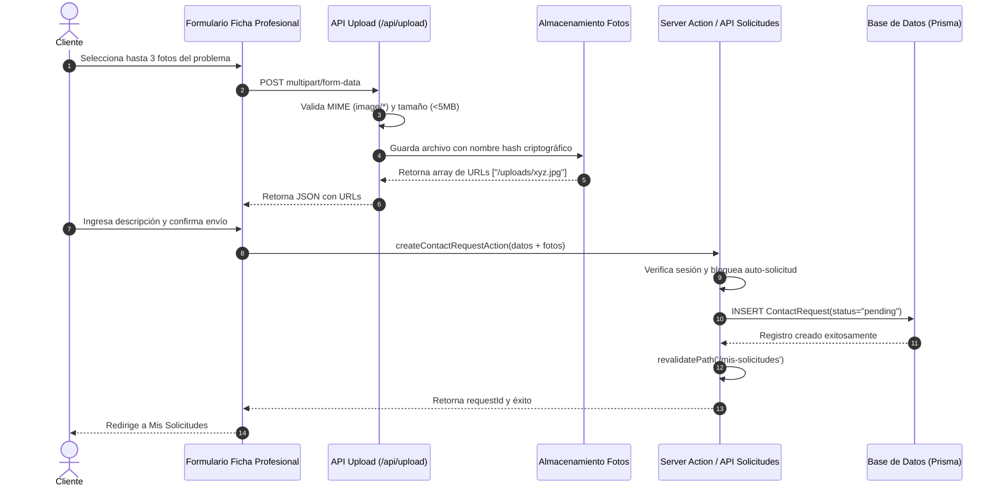
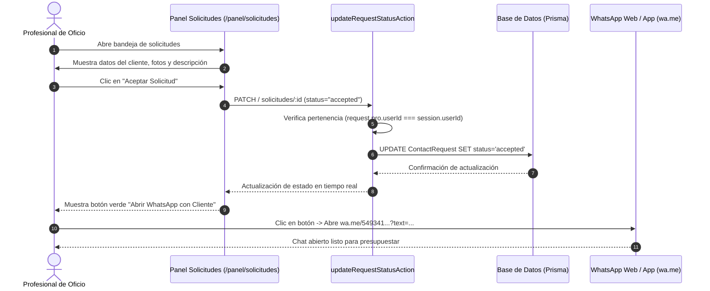
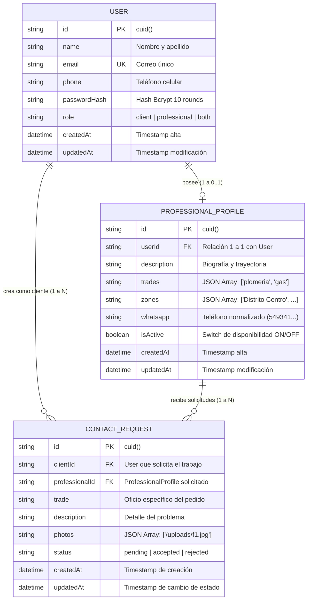

# Arquitectura del Sistema (ARCHITECTURE.md) — Oficios Express

**Versión:** 1.0.0  
**Fecha:** Septiembre 2026  
**Topología:** Monorepo Turborepo (Web Full-Stack + Mobile Nativo + Paquete Compartido)  
**Entornos:** Desarrollo Local (Zero-Config) & Producción Serverless (Vercel + Neon Postgres)  

---

## 1. Visión General de la Arquitectura

**Oficios Express** está concebido como una plataforma modular de alta velocidad orientada a dispositivos móviles. El sistema implementa una arquitectura monorepo orquestada por **Turborepo**, garantizando una estricta separación de responsabilidades, reutilización de contratos de tipos y constantes entre la aplicación web y la aplicación móvil nativa.

```
oficios-express/
├── apps/
│   ├── web/                    # Next.js 16 (App Router + Server Actions + REST API)
│   └── mobile/                 # React Native (Expo SDK 57 + Expo Router v50+)
├── packages/
│   └── shared/                 # @oficios/shared (Constantes, Tipos TypeScript, DTOs)
├── package.json                # Workspaces de npm
└── turbo.json                  # Pipelines de build, dev y linting
```

---

## 2. Modelo C4 de Arquitectura

### 2.1. Nivel 1: Contexto del Sistema (System Context)

El siguiente diagrama describe las interacciones entre los actores humanos (clientes y profesionales), Oficios Express y los sistemas externos (WhatsApp y la Base de Datos).



---

### 2.2. Nivel 2: Diagrama de Contenedores (Containers)



---

### 2.3. Nivel 3: Diagrama de Componentes (Web & API Backend)



---

## 3. Flujos de Secuencia y Casos de Uso Críticos

### 3.1. Flujo 1: Creación de Solicitud con Subida de Fotos



---

### 3.2. Flujo 2: Aceptación del Profesional y Conexión WhatsApp



---

## 4. Modelo de Datos Relacional (Prisma ORM)

El esquema relacional está diseñado para soportar integridad referencial estricta en eliminaciones en cascada y flexibilidad en atributos multi-valor (oficios y distritos) mediante cadenas JSON validadas por software.



### 4.1. Código del Esquema (`apps/web/prisma/schema.prisma`)
```prisma
generator client {
  provider = "prisma-client-js"
}

datasource db {
  provider = "postgresql"
  url      = env("DATABASE_URL")
}

model User {
  id                  String               @id @default(cuid())
  name                String
  email               String               @unique
  phone               String
  passwordHash        String
  role                String               @default("client") // "client", "professional", "both"
  createdAt           DateTime             @default(now())
  updatedAt           DateTime             @updatedAt
  professionalProfile ProfessionalProfile?
  clientRequests      ContactRequest[]     @relation("ClientRequests")
}

model ProfessionalProfile {
  id          String           @id @default(cuid())
  userId      String           @unique
  user        User             @relation(fields: [userId], references: [id], onDelete: Cascade)
  description String
  trades      String           // JSON string: ["plomeria", "gas"]
  zones       String           // JSON string: ["Distrito Centro", "Distrito Norte"]
  whatsapp    String           // Ej: 5493411234567
  isActive    Boolean          @default(true)
  createdAt   DateTime         @default(now())
  updatedAt   DateTime         @updatedAt
  requests    ContactRequest[] @relation("ProfessionalRequests")
}

model ContactRequest {
  id             String              @id @default(cuid())
  clientId       String
  client         User                @relation("ClientRequests", fields: [clientId], references: [id], onDelete: Cascade)
  professionalId String
  professional   ProfessionalProfile @relation("ProfessionalRequests", fields: [professionalId], references: [id], onDelete: Cascade)
  trade          String
  description    String
  photos         String?             // JSON string: ["/uploads/img1.jpg"]
  status         String              @default("pending") // "pending", "accepted", "rejected"
  createdAt      DateTime            @default(now())
  updatedAt      DateTime            @updatedAt
}
```

---

## 5. Contratos de la API REST (`/api/*`)

Para dar soporte integral al cliente móvil React Native / Expo, el backend expone los siguientes endpoints REST normalizados bajo la interfaz `ApiResponse<T>` de `@oficios/shared`:

### 5.1. Resumen de Endpoints

| Método | Endpoint | Autenticación Requerida | Propósito |
|---|---|---|---|
| `POST` | `/api/auth/register` | No | Registro de nuevo usuario (cliente o pro) |
| `POST` | `/api/auth/login` | No | Inicio de sesión, retorna JWT y datos de perfil |
| `GET` | `/api/profesionales` | No | Listado con filtros (`?trade=...&zone=...`) |
| `GET` | `/api/profesionales/:id`| No | Ficha detallada de un profesional específico |
| `GET` | `/api/solicitudes` | Sí (Bearer / Cookie) | Solicitudes asociadas al usuario según su rol |
| `POST` | `/api/solicitudes` | Sí (Bearer / Cookie) | Creación de nueva solicitud de contacto |
| `PATCH`| `/api/solicitudes/:id` | Sí (Bearer / Cookie) | Actualización de estado (`accepted` o `rejected`) |
| `POST` | `/api/upload` | No / Opcional | Subida multipart de hasta 3 fotos |
| `GET` | `/api/seed` | No (Protegido por env)| Inicialización idempotente con datos de prueba |

### 5.2. Estructura de Respuestas (`ApiResponse<T>`)
```typescript
export interface ApiResponse<T = unknown> {
  success: boolean;
  data?: T;
  error?: string;
  message?: string;
}
```

---

## 6. Estrategia de Autenticación Dual (Web vs Mobile)

Para maximizar la seguridad en la web y la compatibilidad en aplicaciones nativas móviles, el backend de Oficios Express implementa una estrategia de **detección de credenciales polimórfica** en `apps/web/src/lib/auth.ts`:

1. **Clientes Web (Navegador Desktop y Mobile):**
   - Utilizan una **Cookie HTTP-Only** (`oficios_session`).
   - El token nunca se expone a `window` ni a JavaScript, anulando ataques de robo de sesión por XSS.
   - Duración: 30 días con política `SameSite=Lax`.
2. **Clientes Móviles Nativos (React Native / Expo):**
   - Transmiten el token mediante el encabezado estándar:  
     `Authorization: Bearer <jwt_token>`
   - La función `getSessionFromRequest(request)` inspecciona primero si existe el encabezado `Authorization`. Si está presente y comienza con `Bearer `, valida dicho token; si no, inspecciona el almacén de cookies.

---

## 7. Registro de Decisiones de Arquitectura (ADRs)

### ADR-001: Adopción de Next.js 16 App Router y Server Actions
- **Contexto:** Se requería un stack full-stack de última generación con alto rendimiento móvil en conexiones fluctuantes.
- **Decisión:** Utilizar Next.js 16 con React 19 Server Components y Server Actions (`"use server"`).
- **Consecuencias:** Reducción drástica del bundle de JavaScript enviado al cliente; las mutaciones no requieren controladores REST intermedios en la web y aprovechan la invalidación de caché integrada (`revalidatePath`).

### ADR-002: Arquitectura Monorepo con Turborepo
- **Contexto:** Mantener sincronizadas las definiciones de datos entre la web y la aplicación móvil Expo.
- **Decisión:** Configurar Turborepo con `@oficios/shared`, `@oficios/web` y `@oficios/mobile`.
- **Consecuencias:** Cero duplicación de tipos TypeScript, listas de oficios y distritos de Rosario. Si cambia una interfaz de API, ambos clientes se benefician de la comprobación estricta de tipos de TypeScript durante el build.

### ADR-003: WhatsApp (`wa.me`) como Protocolo de Handoff
- **Contexto:** Diseñar un chat propio en tiempo real implicaba altos costos de infraestructura de WebSockets, push notifications y moderación.
- **Decisión:** Derivar la conversación a WhatsApp una vez que el profesional acepta la solicitud.
- **Consecuencias:** Costo de infraestructura \$0 para mensajería; tasa de apertura de mensajes cercana al 100% en el mercado argentino.

### ADR-004: Dualidad de Motor de Base de Datos vía Prisma ORM
- **Contexto:** Para desarrollo local rápido se busca evitar la necesidad obligatoria de Docker, pero en despliegue productivo serverless se requiere un motor relacional escalable.
- **Decisión:** Configurar Prisma con soporte para PostgreSQL (Neon / Vercel Postgres) y script de sincronización `scripts/db-sync.mjs`.
- **Consecuencias:** Onboarding inmediato para cualquier desarrollador nuevo con SQLite o Postgres, garantizando integridad referencial estricta en producción.

### ADR-005: Almacenamiento JSON para Colecciones Rápidas
- **Contexto:** Los oficios y zonas de cobertura de un profesional son colecciones pequeñas (1 a 6 elementos) de lectura masiva.
- **Decisión:** Guardar `trades`, `zones` y `photos` como cadenas JSON serializadas dentro de la misma tupla relacional, complementadas con parseo en la capa de tipos de TypeScript.
- **Consecuencias:** Reduce las operaciones JOIN en consultas frecuentes del catálogo, mejorando la velocidad de respuesta a menos de 50 milisegundos.
