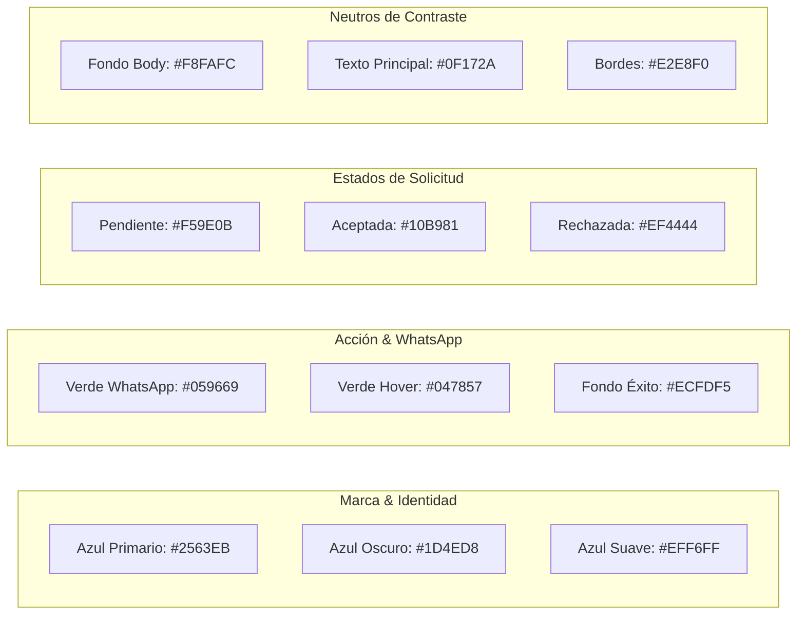

# Sistema de Diseño y Guía UI/UX (DESIGN_SYSTEM.md) — Oficios Express

**Versión:** 1.0.0  
**Enfoque:** Mobile-First, Alta Eficiencia, Accesibilidad Táctil (WCAG 2.1 AA)  
**Plataformas:** Web (Tailwind CSS v4 + React 19) & Mobile (React Native + Expo SDK 57)  
**Ecosistema Geográfico:** Rosario, Santa Fe (Argentina)  

---

## 1. Filosofía de Diseño y Principios de Identidad

El sistema de diseño de **Oficios Express** responde a un contexto de uso de alta fricción y urgencia: el usuario recurre a la aplicación cuando tiene un problema en su vivienda (un caño desbordado, un corte de luz o una fuga de gas) o el profesional la consulta en medio de una jornada laboral en la calle, con luz solar directa y posibles limitaciones de conectividad.

### Pilares Fundamentales:
1. **Claridad & Sobriedad Funcional:** Evitar adornos innecesarios o sobrecarga visual. La interfaz prioriza la acción y la legibilidad inmediata.
2. **Ergonomía Táctil Rigurosa:** Diseñado para operarse con una sola mano (área del pulgar). Todo elemento interactivo respeta un área de impacto mínima de **44 × 44 píxeles**.
3. **Semántica de Confianza y Calma:** Uso de azules técnicos para transmitir seguridad y seriedad profesional, combinado con el verde de WhatsApp exclusivamente como acelerador de contacto.
4. **Respuesta Rápida y Estados Claros:** Ninguna interacción queda sin feedback visual. Los spinners, estados de carga y etiquetas de estado (`pending`, `accepted`, `rejected`) comunican certeza en todo momento.

---

## 2. Paleta Cromática y Tokens Semánticos

La paleta se estructura sobre tokens semánticos normalizados tanto en clases de utilidad Tailwind CSS v4 para la aplicación web como en constantes de tema para la aplicación móvil nativa.



### 2.1. Tabla de Tokens de Color

| Token Semántico | Hex | Tailwind v4 Class | Uso Específico |
|---|---|---|---|
| `brand-primary` | `#2563EB` | `bg-blue-600` / `text-blue-600` | Botones de acción principal, logo, encabezados clave |
| `brand-primary-hover`| `#1D4ED8` | `bg-blue-700` | Estado hover/active de botones principales |
| `brand-primary-light`| `#EFF6FF` | `bg-blue-50` / `border-blue-200` | Fondos de destacados, badges de oficios activos |
| `action-whatsapp` | `#059669` | `bg-emerald-600` / `text-white` | Botón exclusivo de apertura de chat WhatsApp (`wa.me`) |
| `action-whatsapp-hover`|`#047857`| `bg-emerald-700` | Hover sobre botón de WhatsApp |
| `status-pending` | `#F59E0B` | `bg-amber-500` / `text-amber-700` | Badge de solicitud en espera de revisión |
| `status-pending-bg` | `#FFFBEB` | `bg-amber-50` / `border-amber-200` | Fondo contenedor de solicitud pendiente |
| `status-accepted` | `#10B981` | `bg-emerald-500` / `text-emerald-700`| Badge de solicitud aprobada y lista para chatear |
| `status-accepted-bg`| `#ECFDF5` | `bg-emerald-50` / `border-emerald-200`| Fondo contenedor de solicitud aceptada |
| `status-rejected` | `#EF4444` | `bg-red-500` / `text-red-700` | Badge de solicitud declinada o cancelada |
| `status-rejected-bg`| `#FEF2F2` | `bg-red-50` / `border-red-200` | Fondo contenedor de solicitud rechazada |
| `surface-bg` | `#F8FAFC` | `bg-slate-50` | Fondo general de pantalla (evita encandilamiento) |
| `surface-card` | `#FFFFFF` | `bg-white` | Tarjetas, modales, hojas de navegación |
| `border-subtle` | `#E2E8F0` | `border-slate-200` | Delimitadores de tarjetas y líneas divisorias |
| `text-primary` | `#0F172A` | `text-slate-900` | Títulos, nombres de profesionales, textos principales |
| `text-secondary` | `#475569` | `text-slate-600` | Descripciones secundarias, zonas de cobertura |
| `text-muted` | `#94A3B8` | `text-slate-400` | Timestamps, textos de ayuda y placeholders |

### 2.2. Soporte Móvil (Tema Oscuro y Claro)
En la aplicación nativa (`apps/mobile/src/constants/theme.ts`):
```typescript
export const Colors = {
  light: {
    text: '#0F172A',
    background: '#FFFFFF',
    backgroundElement: '#F1F5F9',
    backgroundSelected: '#E2E8F0',
    textSecondary: '#475569',
    brandPrimary: '#2563EB',
    whatsappGreen: '#059669',
  },
  dark: {
    text: '#F8FAFC',
    background: '#0F172A',
    backgroundElement: '#1E293B',
    backgroundSelected: '#334155',
    textSecondary: '#94A3B8',
    brandPrimary: '#3B82F6',
    whatsappGreen: '#10B981',
  },
} as const;
```

---

## 3. Tipografía y Escala Jerárquica

Se adopta una pila de fuentes nativas del sistema operativo (*system font stack*), eliminando la descarga de fuentes web externas para asegurar renderizado instantáneo sin flash de texto no estilizado (FOUT).

```
Web: -apple-system, BlinkMacSystemFont, "Segoe UI", Roboto, Helvetica, Arial, sans-serif
iOS: system-ui (SF Pro)
Android: Roboto
```

### Escala Tipográfica Normalizada

| Nivel | Tamaño (px / rem) | Peso | Line Height | Uso Principal |
|---|---|---|---|---|
| **Display / Hero** | `28px` / `1.75rem` | Bold (700) | `1.2` | Título principal de Home ("Encontrá profesionales en Rosario") |
| **Heading 1 (H1)** | `22px` / `1.375rem` | Bold (700) | `1.25` | Nombre del profesional en ficha `/profesionales/[id]` |
| **Heading 2 (H2)** | `18px` / `1.125rem` | Semibold (600) | `1.3` | Títulos de secciones ("Solicitudes Recibidas", "Mi Perfil") |
| **Heading 3 (H3)** | `16px` / `1.0rem` | Semibold (600) | `1.4` | Títulos en tarjetas de profesionales |
| **Body Regular** | `15px` / `0.9375rem`| Normal (400) | `1.5` | Descripciones de perfil y detalle de solicitudes |
| **Body Small** | `13px` / `0.8125rem`| Normal / Medium | `1.4` | Zonas de cobertura, distritos, metadatos |
| **Caption / Badge** | `11px` / `0.6875rem`| Semibold (600) | `1.2` | Badges de estado, píldoras de oficios, chips de Rosario |

> [!IMPORTANT]
> **Prevención de Zoom en iOS Safari:**  
> Todos los campos de entrada de formulario (`<input>`, `<select>`, `<textarea>`) deben tener un tamaño de fuente de **al menos 16px (`text-base`)** en dispositivos móviles para impedir que el navegador aplique zoom automático al enfocar el campo.

---

## 4. Retícula, Espaciado y Ergonomía Táctil

### 4.1. Escala de Espaciado (Base 4px / 8px)
- `space-1`: 4px — Separación mínima de iconos y micro-textos
- `space-2`: 8px — Separación entre badges y chips
- `space-3`: 12px — Padding interno de botones compactos
- `space-4`: 16px — Padding estándar de tarjetas y contenedores móviles
- `space-6`: 24px — Separación entre bloques de secciones
- `space-8`: 32px — Márgenes de cabecera y pie de página

### 4.2. Ergonomía Táctil (Thumb-Zone Optimization)
- **Área mínima interactiva:** Todos los botones, toggles y selectores tienen un alto mínimo de `44px` (`min-h-[44px]` o `h-11`).
- **Separación entre acciones destructivas y de confirmación:** Mínimo `12px` de margen entre "Aceptar" y "Rechazar" para evitar pulsaciones erróneas.
- **Acciones fijas en parte inferior:** En flujos móviles complejos (como el formulario de solicitud), los botones de acción se ubican en la mitad inferior de la pantalla.

```
+----------------------------------------+
| [Filtros: Oficio v] [Distrito v]       | <- Zona de Navegación
+----------------------------------------+
|                                        |
|   Tarjetas de profesionales            | <- Zona de Visualización
|                                        |
| +------------------------------------+ |
| | Roberto Gómez                      | |
| | [Ver y Contactar]                  | | <- Zona Fácil (Pulgar)
| +------------------------------------+ |
|                                        |
+----------------------------------------+
```

---

## 5. Especificaciones de Componentes

### 5.1. Barra de Navegación Superior (`Navbar.tsx`)
- **Altura fija:** `56px` (`h-14`) en móviles, `64px` (`h-16`) en pantallas mayores a 640px.
- **Comportamiento:** Sticky superior (`sticky top-0 z-40`) con fondo traslúcido `bg-white/95` y desenfoque `backdrop-blur` para preservar contexto durante el scroll.
- **Elementos clave:**
  - Logotipo: Icono de martillo (`Hammer`) en caja azul de bordes redondeados (`rounded-lg bg-blue-600`) + tipografía de marca `OficiosExpress`.
  - Chip identificador geográfico: Insignia fija con icono `MapPin` y texto "Rosario".
  - Acceso condicional según estado de sesión (Visitante: "Ingresar" y "Soy profesional"; Profesional: "Solicitudes", "Mi Perfil" y "Cerrar sesión"; Cliente: "Mis Solicitudes").

### 5.2. Tarjeta de Profesional (`ProfessionalCard`)
- **Estructura visual:**
  ```
  +-------------------------------------------------------------+
  | [Avatar/TradeIcon]  Roberto Gómez         ● Disponible ahora|
  |                     Plomero & Gasista      (Distrito Centro)|
  |                                                             |
  | "Especialista en fugas, cambio de griferías y calderas..."  |
  |                                                             |
  | [Plomería] [Gas]     [Distrito Centro] [Distrito Norte]     |
  |                                                             |
  | [                    Ver Ficha y Contactar >              ] |
  +-------------------------------------------------------------+
  ```
- **Bordes y sombras:** `rounded-xl border border-slate-200 bg-white p-4 shadow-xs hover:border-blue-300 transition`.
- **Indicador de Disponibilidad:**
  - Activo: Círculo verde pulsante o sólido con texto `Disponible ahora` (`text-emerald-700 bg-emerald-50`).
  - Inactivo: Círculo gris con texto `No disponible actualmente` (`text-slate-500 bg-slate-100`).

### 5.3. Botón de Conexión Rápida con WhatsApp (`WhatsAppButton.tsx`)
- **Diseño distintivo:** Verde esmeralda intenso (`bg-emerald-600 hover:bg-emerald-700 text-white font-semibold`).
- **Iconografía:** Icono de teléfono o chat acompañado de texto explicativo explícito: `"Contactar por WhatsApp"`.
- **Formato URL:** Generación estricta de deep-link:
  ```
  https://wa.me/549341XXXXXXX?text=Hola%20Roberto,%20te%20contacto%20desde%20Oficios%20Express%20por%20mi%20solicitud...
  ```
- **Target:** `target="_blank" rel="noopener noreferrer"` en Web; `Linking.openURL()` en Mobile.

### 5.4. Uploader Fotográfico Multi-Archivo (`ContactRequestForm.tsx`)
- **Restricciones:** Máximo 3 imágenes simultáneas, formatos aceptados: `.jpg`, `.jpeg`, `.png`, `.webp`. Tamaño máximo por archivo: `5 MB`.
- **Interacción:**
  - Botón de carga con icono de cámara o nube (`UploadCloud`).
  - Previsualización inmediata en miniatura (`w-20 h-20 rounded-lg object-cover`) con botón individual de eliminación (icono cruz `X` en círculo rojo).
  - Barra o indicador visual de progreso durante el envío a `/api/upload`.
  - Bloqueo preventivo del botón de envío general mientras la carga de imágenes no haya finalizado.

### 5.5. Insignias de Oficios y Mapeo de Iconos (`TradeIcon.tsx`)
Mapeo exhaustivo de iconos vectoriales de Lucide:
- **Plomería:** `Wrench` (Llave inglesa)
- **Electricidad:** `Zap` (Rayo de energía)
- **Gas:** `Flame` (Llama de fuego)
- **Albañilería:** `Hammer` (Martillo)
- **Pintura:** `Paintbrush` (Pincel)
- **Cerrajería:** `KeyRound` (Llave)
- **Carpintería:** `Axe` (Hacha / Madera)
- **Jardinería:** `Trees` (Árboles)
- **Climatización:** `Fan` (Ventilador / Turbina de aire)

---

## 6. Microcopia, Tono de Voz y Localización de Rosario

El lenguaje de la interfaz es cercano, confiable y directo, utilizando la convención de tratamiento local de la provincia de Santa Fe (voseo respetuoso):

### Guía de Microcopia

| Contexto | Mensaje Recomendado | Mensaje a Evitar | Justificación |
|---|---|---|---|
| **Acceso general** | *"Ingresá a tu cuenta"* | *"Inicie sesión en el sistema"* | Cercano y natural para usuarios de Rosario |
| **Llamado a la acción** | *"Enviar solicitud al profesional"* | *"Crear lead de contacto"* | Claridad absoluta sobre el efecto de la acción |
| **Zona de servicio** | *"Distrito Centro, Distrito Norte..."* | *"Área metropolitana 1"* | Usa la división administrativa real y conocida |
| **Sin resultados** | *"No encontramos plomeros disponibles en Distrito Sur en este momento"* | *"Error 404: Sin registros"* | Empatía con el usuario y sugerencia de acción |
| **Éxito de solicitud** | *"¡Solicitud enviada! Roberto te responderá a la brevedad"* | *"Petición procesada con éxito"* | Reaseguro emocional ante una emergencia |

---

## 7. Accesibilidad (Checklist WCAG 2.1 AA)

- [x] **Relación de Contraste:** Mínimo de `4.5:1` para texto estándar sobre fondo (`#0F172A` sobre `#FFFFFF` = `16.2:1`).
- [x] **Focus Visible:** Todos los elementos interactivos cuentan con anillo de foco visible (`focus-visible:ring-2 focus-visible:ring-blue-600 focus-visible:outline-hidden`).
- [x] **Textos Alternativos:** Todas las imágenes y fotografías de solicitudes incluyen etiquetas `alt` descriptivas.
- [x] **Sin Pérdida de Información por Color:** Los estados (`pending`, `accepted`, `rejected`) combinan color con texto explicativo e icono vectorial; nunca se depende solo del color.
