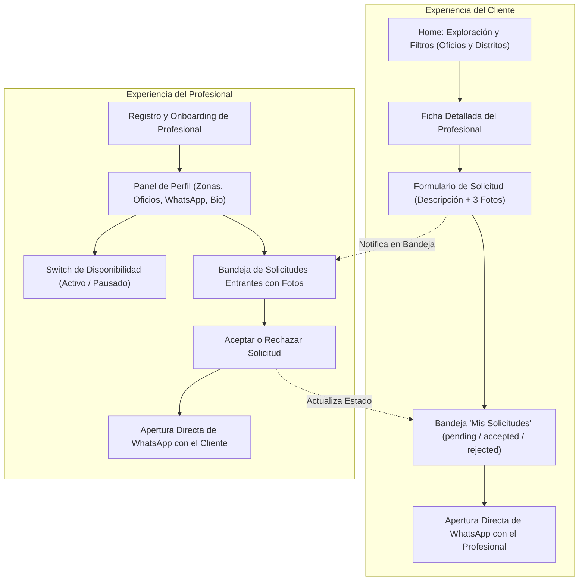
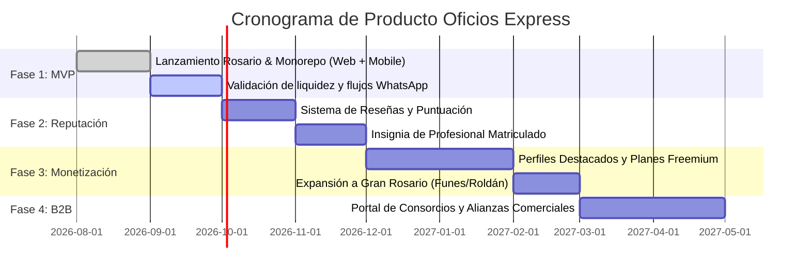

# Product Requirements Document (PRD) — Oficios Express

**Versión:** 1.0.0  
**Fecha de Actualización:** Septiembre 2026  
**Mercado Objetivo:** Rosario, Santa Fe (Argentina)  
**Estado:** MVP Validado / Producción Estable (`v0.1.0`)  
**Autor:** Equipo de Producto & Arquitectura de Oficios Express  

---

## 1. Resumen Ejecutivo (Executive Summary)

**Oficios Express** es una plataforma digital hiperlocal *mobile-first* creada específicamente para el ecosistema urbano del **Gran Rosario (Santa Fe, Argentina)**. Su misión es conectar en menos de 2 minutos a personas que sufren urgencias domésticas o necesitan mantenimiento hogareño con profesionales de oficios independientes, verificados y geolocalizados por distrito municipal.

A diferencia de los clasificados tradicionales, los grupos dispersos de Facebook o las plataformas internacionales con tarifas abusivas y barreras burocráticas, Oficios Express resuelve la fricción real del mercado argentino:
- **Cero fricción de búsqueda:** Exploración inmediata sin requerir registro previo.
- **Diagnóstico visual preventivo:** Solicitudes con hasta 3 fotografías del problema real (caños rotos, tableros quemados, filtraciones), permitiendo presupuestar y preparar herramientas antes de viajar.
- **Canal de comunicación nativo:** Cierre del contacto directo a través de **WhatsApp (`wa.me`)**, la herramienta de comunicación universalmente adoptada por los trabajadores de oficios en Argentina.
- **Soberanía y control del profesional:** Switch de disponibilidad en tiempo real para evitar saturación y llamadas en momentos inoportunos.

---

## 2. El Problema y la Oportunidad de Mercado

### 2.1. Dolores del Cliente (Demanda / Hogares en Rosario)
1. **Incertidumbre y Falta de Confianza:** La búsqueda de plomeros, electricistas o gasistas se basa en recomendaciones informales de boca en boca ("el número que me pasó mi tía"), con alta probabilidad de números desactualizados o trabajadores inactivos.
2. **Urgencia Desatendida:** Ante una fuga de gas, un cortocircuito o una canilla rota, el usuario necesita saber en segundos quién trabaja en su zona (ej. Distrito Centro, Distrito Norte) y si está disponible en ese preciso momento.
3. **Dificultad de Explicación Técnica:** El cliente promedio desconoce la nomenclatura técnica de repuestos y materiales ("pierde agua por abajo de la bacha"). La falta de imágenes previas genera presupuestos inexactos y visitas en vano.

### 2.2. Dolores del Profesional de Oficio (Oferta / Trabajadores Independientes)
1. **Dispersión Geográfica Ineficiente:** Trasladarse desde la zona Sur hasta la zona Noroeste para un arreglo menor de \$15.000 ARS no es rentable debido al costo del combustible, estacionamiento y tiempo de viaje en Rosario.
2. **Pérdida de Tiempo en Diagnósticos a Ciegas:** Llegar al domicilio del cliente sin saber qué marca de calefón o qué tipo de caño de termofusión tiene requiere suspender el trabajo para ir a la ferretería más cercana.
3. **Rechazo a Plataformas Burocráticas:** Las plataformas tradicionales retienen cobros, exigen cobros con tarjeta de crédito en mercados altamente informalizados o cobran comisiones por adelantado sin garantizar el trabajo.
4. **Invasión de la Vida Personal:** El profesional no cuenta con un mecanismo simple para "apagar" la recepción de nuevos pedidos cuando su agenda semanal está completa o durante sus días de descanso.

### 2.3. Oportunidad en Rosario
Rosario cuenta con más de 1.3 millones de habitantes en su aglomerado metropolitano, estructurado administrativamente en **6 distritos municipales**. La penetración de smartphones supera el 94% y WhatsApp es el canal comercial por excelencia. Existe una oportunidad crítica de liderar el segmento de servicios del hogar mediante una herramienta rápida, local y sin fricción.

---

## 3. Personas de Usuario (User Personas)

### Persona 1: Cliente Hogareño en Urgencia
- **Nombre:** Sofía Martínez (34 años)
- **Ocupación:** Empleada administrativa / Inquilina
- **Ubicación:** Barrio Pichincha (Distrito Centro, Rosario)
- **Contexto:** Llega de trabajar a las 19:30 y encuentra un charco de agua saliendo de la bacha de la cocina.
- **Comportamiento Digital:** Usa el celular para todo. Prefiere resolver por chat antes que hacer llamadas telefónicas frías.
- **Frustración:** En Facebook los posts son viejos; en Google aparecen empresas con presupuestos corporativos elevados.
- **Objetivo en la app:** Entrar, filtrar "Plomería" + "Distrito Centro", ver un profesional disponible, mandarle 2 fotos de la pérdida y recibir contacto por WhatsApp para coordinar la visita esa misma noche o la mañana siguiente.

### Persona 2: Profesional de Oficio Independiente
- **Nombre:** Roberto Gómez (48 años)
- **Ocupación:** Gasista matriculado y plomero
- **Ubicación:** Barrio Arroyito (Distrito Norte, Rosario)
- **Herramientas:** Camioneta furgón, caja de herramientas, celular Android con WhatsApp Business.
- **Frustración:** Clientes que lo llaman desde la otra punta de la ciudad por reparaciones menores; tener que pedirles fotos por WhatsApp de forma desordenada mezcladas con chats familiares.
- **Objetivo en la app:** Tener un perfil prolijo con sus zonas habituales (Norte y Centro), recibir pedidos organizados con fotos claras del problema, aceptar con un tap para abrir el WhatsApp del cliente, y desactivar el switch a "No disponible" cuando está tapado de trabajo.

---

## 4. Principios Rectores del Producto (Product Principles)

1. **Mobile-First Real & Cero Bloqueos:** El 90%+ del tráfico ocurre en teléfonos móviles con conexiones 4G/5G oscilantes. El First Contentful Paint debe ser inferior a 1.2 segundos y la interfaz debe ser operable con una sola mano (ergonomía de dedos en pulgares).
2. **Descubrimiento sin Registro (Frictionless Discovery):** Cualquier vecino puede navegar el catálogo, filtrar por oficio y distrito, y examinar fichas de profesionales sin crearse una cuenta. El registro solo se solicita al enviar la solicitud.
3. **Fotografía como Lenguaje Común:** Hasta 3 imágenes por solicitud. Ahorra 40 minutos promedio en coordinación y pre-diagnóstico técnico.
4. **Respeto por el Ecosistema Local (WhatsApp Native):** No competir con WhatsApp. Oficios Express actúa como el motor de coincidencia (matchmaker) y orquesta la conexión inicial vía `wa.me` con mensaje pre-estructurado.
5. **Simplicidad Transaccional:** El cobro del trabajo se acuerda y se realiza entre las partes según la costumbre local (efectivo, transferencia bancaria / alias, Mercado Pago en el lugar). La plataforma no retiene fondos ni interfiere en la liquidación en el MVP.

---

## 5. Alcance Funcional del MVP (v0.1.0)

### 5.1. Módulos y Funcionalidades Incluidas (In-Scope)



#### A. Catálogo y Motor de Búsqueda Distrital
- **9 Oficios Esenciales:** Plomería, Electricidad, Gas, Albañilería, Pintura, Cerrajería, Carpintería, Jardinería, Climatización.
- **6 Distritos Oficiales de Rosario:** Distrito Centro, Distrito Norte, Distrito Noroeste, Distrito Oeste, Distrito Sudoeste, Distrito Sur.
- Tarjetas con estado de disponibilidad en tiempo real ("Disponible ahora" vs "No disponible").

#### B. Ficha Pública del Profesional
- Biografía técnica y años de trayectoria.
- Insignias de oficios atendidos y distritos con cobertura.
- Enlace directo a formulario de contacto modal/integrado.
- Validaciones preventivas (un profesional no puede enviarse una solicitud a sí mismo).

#### C. Creación de Solicitudes con Subida de Imágenes
- Selector de oficio requerido dentro de las especialidades del profesional.
- Campo descriptivo amplio para detallar el síntoma del desperfecto.
- Uploader multimedia de hasta 3 fotografías (PNG, JPG, WEBP) con límite de 5 MB por archivo.

#### D. Bandeja del Cliente (`/mis-solicitudes`)
- Visualización cronológica de todas las solicitudes enviadas.
- Etiquetas de estado semánticas:
  - 🟡 **Pendiente:** En espera de revisión por el profesional.
  - 🟢 **Aceptada:** Desbloquea botón de acción rápida para abrir chat en WhatsApp con el profesional.
  - 🔴 **Rechazada:** Indica al usuario que el profesional no puede tomar el trabajo.

#### E. Panel de Gestión del Profesional (`/panel/solicitudes` y `/panel/perfil`)
- Listado de solicitudes entrantes con datos de contacto del cliente, descripción y galería de fotos ampliables.
- Acciones atómicas: **Aceptar** (habilita botón para chatear con el cliente) o **Rechazar**.
- Configuración de perfil: Edición de bio, selección múltiple de oficios, distritos y número de WhatsApp con normalización automática a formato internacional argentino (`549341...`).
- Control maestro de disponibilidad (`isActive`) mediante switch instantáneo.

#### F. Plataforma Multi-Cliente (Web + Mobile App)
- **Web App (Next.js 16):** PWA responsive optimizada para motores de búsqueda y navegadores móviles.
- **Mobile App (React Native con Expo SDK 57):** Experiencia nativa en Android e iOS conectada a la misma API REST y base de datos relacional compartida.

### 5.2. Fuera del Alcance Inicial (Out-of-Scope MVP)
- Pasarela de pago embebida con retención de garantía (escrow).
- Sistema bidireccional público de calificaciones con estrellas (previsto para Fase 2).
- Chat propietario in-app con WebSockets.
- Seguimiento de geolocalización por GPS en tiempo real en mapa.
- Facturación electrónica AFIP/ARCA automática integrada.

---

## 6. Historias de Usuario y Criterios de Aceptación (Gherkin)

### US-01: Descubrimiento de profesionales por oficio y distrito
**Como** vecino de Rosario con una necesidad en el hogar,  
**quiero** filtrar el listado de profesionales por mi oficio de interés y mi distrito municipal,  
**para** encontrar rápidamente a alguien cercano y con disponibilidad.

```gherkin
Escenario: Filtrado exitoso por oficio y distrito en Rosario
  Dado que un usuario no autenticado ingresa a la página principal
  Cuando selecciona el oficio "Plomería"
  Y selecciona la zona "Distrito Centro"
  Entonces el sistema muestra únicamente los profesionales activos que atienden Plomería en Distrito Centro
  Y cada tarjeta indica claramente si el profesional se encuentra "Disponible ahora".
```

### US-02: Envío de solicitud con fotografías
**Como** cliente que necesita reparar un caño con pérdida,  
**quiero** enviar una solicitud adjuntando fotos del problema y describiendo la falla,  
**para** que el profesional conozca la situación exacta antes de presupuestar.

```gherkin
Escenario: Envío de solicitud completa con imágenes adjuntas
  Dado que un cliente autenticado está en la ficha del profesional "Roberto Gómez"
  Cuando selecciona el oficio "Plomería"
  Y escribe "Pérdida en el codo de la bacha bajo mesada"
  Y adjunta 2 fotografías válidas de 2 MB cada una
  Y presiona "Enviar Solicitud"
  Entonces la solicitud se registra con estado "pending"
  Y el cliente es redirigido a "/mis-solicitudes" donde ve el ticket recién creado
  Y el profesional recibe la solicitud con las miniaturas de las 2 fotos.

Escenario: Bloqueo de auto-solicitud para un profesional
  Dado que un usuario con rol "professional" tiene la sesión iniciada
  Cuando visita su propia ficha pública de profesional
  Entonces el sistema deshabilita el formulario de contacto con un mensaje que indica que no puede enviarse solicitudes a sí mismo.
```

### US-03: Aceptación y contacto directo por WhatsApp
**Como** profesional de oficio que recibe una solicitud,  
**quiero** evaluar la descripción y fotos para aceptar el trabajo y abrir WhatsApp,  
**para** coordinar el horario de visita y presupuesto de forma inmediata.

```gherkin
Escenario: Aceptación de solicitud y apertura de WhatsApp
  Dado que un profesional autenticado ingresa a "/panel/solicitudes"
  Y visualiza una solicitud pendiente con descripción y fotos
  Cuando presiona el botón "Aceptar Solicitud"
  Entonces el estado del ticket pasa a "accepted"
  Y aparece el botón verde "Abrir WhatsApp con el Cliente"
  Y al hacer clic se abre la URL "https://wa.me/549341XXXXXXX?text=..." con un mensaje pre-cargado con referencia a la solicitud.
```

### US-04: Control de disponibilidad en tiempo real
**Como** profesional ocupado con alta demanda,  
**quiero** apagar temporalmente mi disponibilidad desde mi panel de perfil,  
**para** dejar de recibir nuevas solicitudes mientras estoy en una obra grande.

```gherkin
Escenario: Desactivación de disponibilidad
  Dado que un profesional está en "/panel/perfil" con disponibilidad activa
  Cuando desmarca el switch "Disponible para recibir solicitudes" y guarda
  Entonces su perfil pasa a tener isActive = false
  Y en el catálogo general su ficha se muestra como "No disponible"
  Y el formulario de contacto en su ficha queda temporalmente bloqueado.
```

---

## 7. Modelo de Negocio y Monetización Proyectada

```
+--------------------------------------------------------------------------+
|                       MODELO DE MONETIZACIÓN OFICIOS EXPRESS            |
+--------------------------------------------------------------------------+
| Fase 1 (MVP Actual):      | Adquisición y Tracción Gratuita             |
|                           | - Registro 100% gratuito para pros y clientes|
|                           | - Foco en liquidez del marketplace y retención|
+---------------------------+----------------------------------------------+
| Fase 2 (Meses 3 a 6):     | Perfiles Verificados & Destacados             |
|                           | - "Pro Verificado" (Matrícula + DNI validado)|
|                           | - Destacados en la cima de cada distrito     |
|                           |   (Suscripción mensual de $8.000 a $15.000)   |
+---------------------------+----------------------------------------------+
| Fase 3 (Meses 7 a 12):    | Paquetes de Contactos (Pay-per-Lead)         |
|                           | - Primeras 5 solicitudes mensuales gratis    |
|                           | - Créditos accesibles por solicitud extra    |
+---------------------------+----------------------------------------------+
| Fase 4 (Escala):          | Alianzas B2B con Corralones & Ferreterías    |
|                           | - Descuentos cruzados para profesionales     |
|                           | - Panel para Administradores de Consorcios   |
+--------------------------------------------------------------------------+
```

---

## 8. Métricas Clave y KPIs (Product Analytics)

| Dimensión | Indicador / Métrica | Meta MVP (Mes 1-3) |
|---|---|---|
| **North Star Metric** | **Conexiones Exitosas por Semana** (Solicitudes aceptadas que derivan en apertura de WhatsApp) | > 150 conexiones / semana |
| **Adquisición Oferta** | Profesionales activos registrados en Rosario (con perfil completo y teléfono verificado) | > 80 profesionales (mín. 10 por distrito) |
| **Tiempo de Respuesta (TTFA)** | Tiempo medio transcurrido entre la creación de la solicitud y la respuesta del profesional | < 45 minutos |
| **Tasa de Aceptación (Match Rate)** | % de solicitudes generadas que son aceptadas por el profesional seleccionado | > 70% |
| **Retención del Profesional** | % de profesionales que mantienen su switch en `isActive = true` y responden al menos 1 pedido semanal | > 65% a 30 días |
| **Uso de Fotos** | % de solicitudes que contienen al menos 1 imagen adjunta | > 60% |

---

## 9. Matriz de Priorización (MoSCoW)

- **MUST HAVE (Esenciales para operar):**
  - Catálogo filtrable por los 6 distritos de Rosario y 9 oficios.
  - Subida de hasta 3 fotos con compresión y validación MIME.
  - Flujo de solicitudes con estados `pending`, `accepted`, `rejected`.
  - Generador de enlaces a WhatsApp con formato internacional (`549341...`).
  - Panel de control de perfil y switch de disponibilidad para el profesional.
  - Autenticación segura dual (Cookies HTTP-Only para Web y Bearer Token para Mobile).
- **SHOULD HAVE (Próxima iteración — Fase 2):**
  - Sistema de calificaciones y comentarios moderados post-servicio.
  - Notificaciones inmediatas por SMS o WhatsApp Business API cuando entra una nueva solicitud.
  - Badge de matriculado con verificación de matrícula oficial (Litoral Gas, EPE, Colegio de Técnicos).
- **COULD HAVE (Fase de Escala — Fase 3):**
  - Expansión geográfica al cordón metropolitano (Funes, Roldán, Granadero Baigorria, Villa Gobernador Gálvez).
  - Presupuestador paramétrico orientativo para materiales y mano de obra.
- **WON'T HAVE (Descartados deliberadamente):**
  - Chat propietario in-app con WebSockets.
  - Pasarela de cobros con retención de fondos.
  - Rastreo continuo de ubicación por GPS en tiempo real en segundo plano.

---

## 10. Roadmap de Entregas y Hitos


