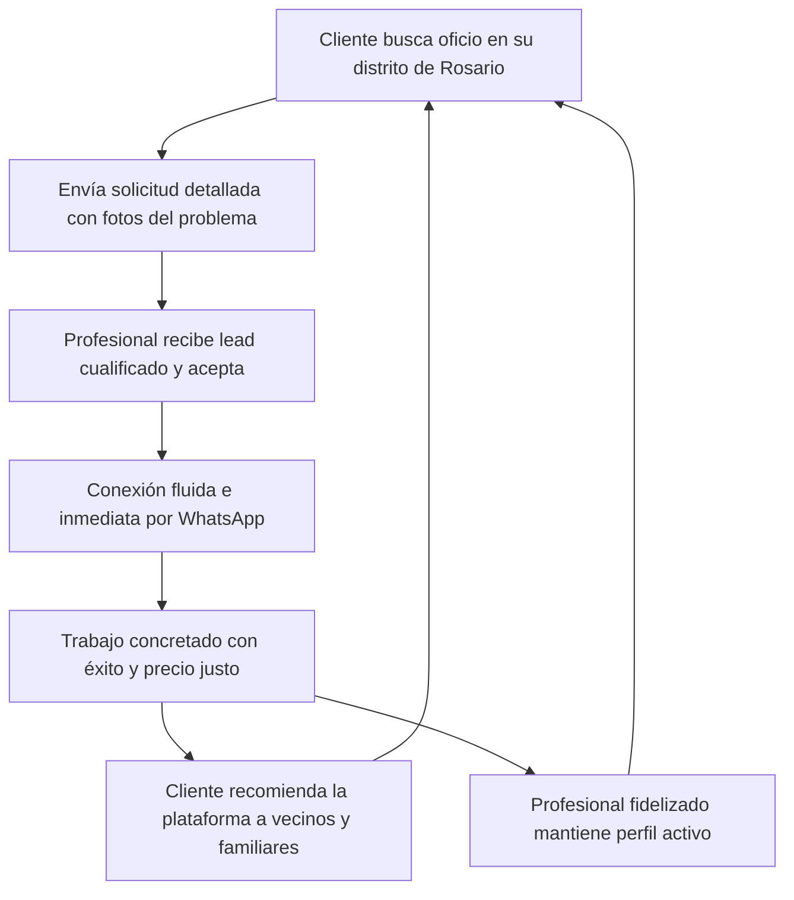

# 02 — Estrategia Go-To-Market (GTM) y Crecimiento

## 1. Estrategia de Lanzamiento Hiperlocal (Rosario)

Los marketplaces de servicios fallan frecuentemente por dispersión geográfica prematura. En **Oficios Express**, la estrategia GTM se basa en el principio de **"Conquista por Distritos Concéntricos"**:

```
[ Distrito Centro + Norte ]  --->  [ Distrito Noroeste + Oeste ]  --->  [ Distrito Sur + Sudoeste ]
      (Fase 1: Sembrado)                  (Fase 2: Expansión)                  (Fase 3: Consolidación)
Alta densidad de edificios           Zonas residenciales mixtas           Industrias, talleres y barrios
y demanda urgente de plomería        y refacciones integrales             consolidados
```

### Por qué arrancar por Distrito Centro y Distrito Norte:
1. **Densidad poblacional y habitacional**: Concentran la mayor cantidad de departamentos y oficinas de la ciudad, donde fallas de agua, cerraduras y electricidad requieren resolución inmediata.
2. **Mayor poder adquisitivo y familiaridad digital**: Usuarios habituados a resolver compras y contrataciones desde su smartphone.
3. **Logística y traslados de los profesionales**: Distancias cortas que permiten a un profesional atender múltiples visitas diarias en bicicleta, moto o transporte público.

---

## 2. Adquisición del Lado de la Oferta (Profesionales)

Sin una oferta sólida y receptiva, la demanda rebota y no vuelve. La captación de los primeros 100 profesionales en Rosario sigue tácticas de "guerrilla" de alta efectividad:

### Tácticas Clave:
1. **Alianzas con Ferreterías y Corralones Clave de Rosario**:
   - Acuerdos con ferreterías de barrio (Pichincha, Echesortu, Alberdi, Centro).
   - Colocación de material POP (carteles en mostradores y códigos QR): *"¿Sos plomero o electricista? Sumate gratis a Oficios Express y recibí pedidos directo a tu WhatsApp"*.
2. **Reclutamiento en Escuelas Técnicas y Centros de Formación**:
   - E.E.T.P. N° 464 (Ing. Colegiales), Escuela Técnica N° 288, centros comunitarios de capacitación en oficios.
   - Presentación de la plataforma a egresados recientes de cursos de gasistas, instaladores de splits y electricistas que buscan construir su cartera de clientes.
3. **Outreach Directo y Verificación Personal**:
   - Contacto respetuoso vía WhatsApp a profesionales activos en carteleras barriales y grupos de Facebook de Rosario.
   - Asistencia personalizada para dar de alta su perfil en menos de 2 minutos.

---

## 3. Adquisición del Lado de la Demanda (Clientes)

### 1. SEO Local Hiperenfocado
Optimización para búsquedas de alta intención de compra en Google:
- *"Plomero urgente Rosario Centro"*
- *"Electricista matriculado Rosario"*
- *"Destapaciones urgencias Rosario Norte"*
- *"Gasista matriculado Rosario"*

### 2. Marketing Digital de Micro-Segmentación Geográfica
- Anuncios en Instagram / Facebook Ads segmentados a radio de 3 km en Distrito Centro y Norte con creatividades contextuales:
  - *"¿Se te rompió la canilla o saltó la térmica? Encontrá profesionales con fotos y contacto directo por WhatsApp en tu barrio de Rosario."*

### 3. Flywheel del Boca a Boca y Stickers QR
- Entrega de stickers con código QR a los profesionales aceptados para que los peguen con autorización en medidores o gavetas de sus clientes: *"Para tu próximo arreglo hogareño, pedí tu oficio de confianza en Oficios Express"*.

---

## 4. El "Flywheel" de Confianza y Retención



---

## 5. Cronograma de Despliegue (Roadmap GTM - 6 Meses)

| Mes | Hitos Principales | Meta de Oferta | Meta de Demanda |
|---|---|---|---|
| **Mes 1** | Lanzamiento MVP, campaña de ferreterías en Centro y Pichincha. | 30 profesionales validados | 150 solicitudes enviadas |
| **Mes 2** | Cobertura en Distrito Norte (Alberdi, Arroyito). Campaña Meta Ads. | 60 profesionales validados | 400 solicitudes enviadas |
| **Mes 3** | Incorporación de testimonios y validaciones de matrículas. | 100 profesionales validados | 800 solicitudes enviadas |
| **Mes 4** | Expansión a distritos Oeste y Noroeste. Lanzamiento de insignia verificada. | 150 profesionales validados | 1.500 solicitudes enviadas |
| **Mes 5** | Activación de distritos Sur y Sudoeste. Alianzas con distribuidoras de insumos. | 220 profesionales validados | 2.500 solicitudes enviadas |
| **Mes 6** | Inicio del programa piloto Freemium (planes destacados). | 300 profesionales validados | 4.000 solicitudes enviadas |
