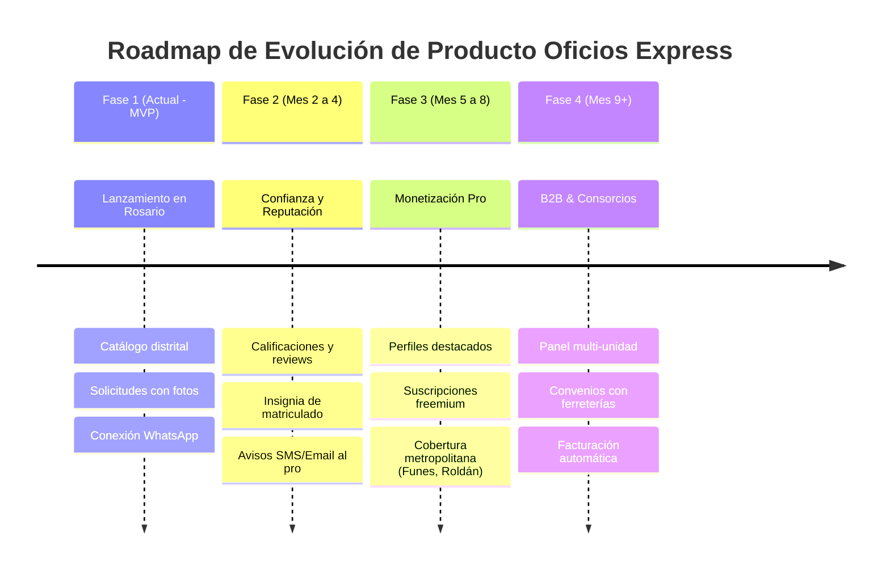

# 01 — Visión y Alcance del Producto (Product Scope & Roadmap)

## 1. Declaración de Visión del Producto

> **Para** vecinos y propietarios de viviendas y comercios en Rosario que experimentan desperfectos o necesitan mantenimiento y reformas en su hogar,  
> **que** se frustran con la informalidad, la tardanza y la falta de disponibilidad de los contactos tradicionales,  
> **Oficios Express** es una plataforma web mobile-first de descubrimiento y contacto ágil  
> **que** geolocaliza a profesionales calificados por oficio y distrito de Rosario, permitiendo solicitar asistencia con fotos y conectar de inmediato vía WhatsApp.  
> **A diferencia de** los grupos masivos de redes sociales o aplicaciones complejas que cobran comisiones invasivas,  
> **nuestro producto** elimina barreras de entrada, permite presupuestar visualmente y respeta el canal nativo de comunicación local: WhatsApp.

---

## 2. Principios de Diseño de Producto

1. **Mobile-First Real**: El 92% de los usuarios accede con urgencia desde su teléfono inteligente mientras mira el caño perdiendo agua o el calefón apagado. Cada pantalla debe cargar en menos de 1 segundo y operarse cómodamente con una sola mano.
2. **Cero Fricción en el Descubrimiento**: Explorar el catálogo, filtrar por oficio y consultar los perfiles de los profesionales no requiere registro ni login previo. El registro solo se solicita al momento exacto en que el usuario decide enviar una solicitud de contacto formal.
3. **Fotos como Lenguaje Técnico Común**: Un cliente no suele saber si necesita "una cupla de termofusión de 3/4 o una rosca hembra"; sabe que "pierde agua ahí". Permitir hasta 3 fotografías reduce malentendidos, ahorra visitas en vano y mejora la precisión del presupuesto del profesional.
4. **Respetar la Cultura de WhatsApp**: No inventar una mensajería interna precaria cuando el 100% de la población de Rosario ya usa WhatsApp a diario. La plataforma actúa como un facilitador de confianza y abre la puerta al chat de WhatsApp (`wa.me`).

---

## 3. Alcance del MVP (Versión Actual 0.1.0)

El MVP actual se concentra con rigor en validar los dos flujos nucleares sin distracciones:

### En el Alcance (In Scope):
- **Catálogo y Filtros**:
  - Filtro por 9 oficios esenciales: Plomería, Electricidad, Gas, Albañilería, Pintura, Cerrajería, Carpintería, Jardinería, Climatización.
  - Filtro por los 6 distritos oficiales de Rosario: Centro, Norte, Noroeste, Oeste, Sudoeste, Sur.
  - Tarjetas de presentación con datos de oficio, zonas de cobertura y estado de actividad.
- **Ficha Pública de Profesional**:
  - Bio descriptiva, insignias de oficios, zonas de cobertura, estado de disponibilidad ("Disponible ahora" vs "No disponible").
  - Formulario de solicitud integrado con selector de oficio, textarea de descripción y selector múltiple de fotos.
- **Subida de Fotografías**:
  - Endpoint seguro de subida de hasta 3 fotos con validación de tipo MIME (imágenes) y límite de 5MB por archivo.
- **Gestión de Solicitudes (Lado Cliente)**:
  - Vista `/mis-solicitudes` con estado en tiempo real (`pending`, `accepted`, `rejected`).
  - Botón directo de apertura de WhatsApp con el profesional una vez que la solicitud fue aceptada.
- **Panel del Profesional**:
  - Bandeja `/panel/solicitudes` para ver solicitudes entrantes con datos del cliente (nombre, teléfono), oficio requerido, descripción detallada y galería de fotos.
  - Acciones atómicas: **Aceptar** (habilita botón de contacto al cliente y cambia estado) o **Rechazar**.
  - Configuración `/panel/perfil` para actualizar datos personales, WhatsApp comercial, oficios, zonas y el switch maestro de disponibilidad (`isActive`).
- **Autenticación y Sesión**:
  - Registro diferenciado (Cliente vs Profesional).
  - Inicio de sesión con cookies HTTP-Only seguras y persistencia de 30 días.

### Fuera del Alcance Inicial (Out of Scope en MVP):
- Pasarela de pagos online dentro de la app (el cobro de los trabajos se realiza en persona entre cliente y profesional).
- Sistema bidireccional de reseñas y estrellas (se incorporará en Fase 2 para no penalizar a los nuevos profesionales con 0 reviews).
- Chat embebido en tiempo real tipo WebSocket (WhatsApp resuelve esto con cero costo de infraestructura).
- Geolocalización por GPS fino por radio de metros (en Rosario, la división por distritos municipales es el estándar mental de traslado habitual).

---

## 4. Matriz de Priorización (MoSCoW)

```
+------------------------------------+------------------------------------+
| MUST HAVE (Imprescindibles MVP)    | SHOULD HAVE (Fase 2 Próxima)       |
|                                    |                                    |
| [x] Catálogo con filtros Rosario   | [ ] Sistema de calificaciones y    |
| [x] Subida de hasta 3 fotos        |     reviews públicas verificadas   |
| [x] Flujo de solicitud y estados   | [ ] Insignia de Profesional        |
| [x] Enlace directo a WhatsApp      |     Matriculado (DNI/matrícula)    |
| [x] Panel de disponibilidad pro    | [ ] Notificaciones push / SMS      |
| [x] Autenticación segura JWT       |     de nueva solicitud entrante    |
+------------------------------------+------------------------------------+
| COULD HAVE (Fase 3 Escala)         | WON'T HAVE (Descartados)           |
|                                    |                                    |
| [ ] Panel B2B para administraciones| [x] Chat propio embebido           |
|     de consorcios en Rosario       | [x] Monedero virtual / wallet      |
| [ ] Tienda de repuestos integrada  |     propia en la app               |
| [ ] Presupuestador paramétrico     | [x] Rastreo GPS continuo en mapa   |
|     orientativo de mano de obra    |     (alto consumo de batería)      |
+------------------------------------+------------------------------------+
```

---

## 5. Roadmap Evolutivo de Producto


