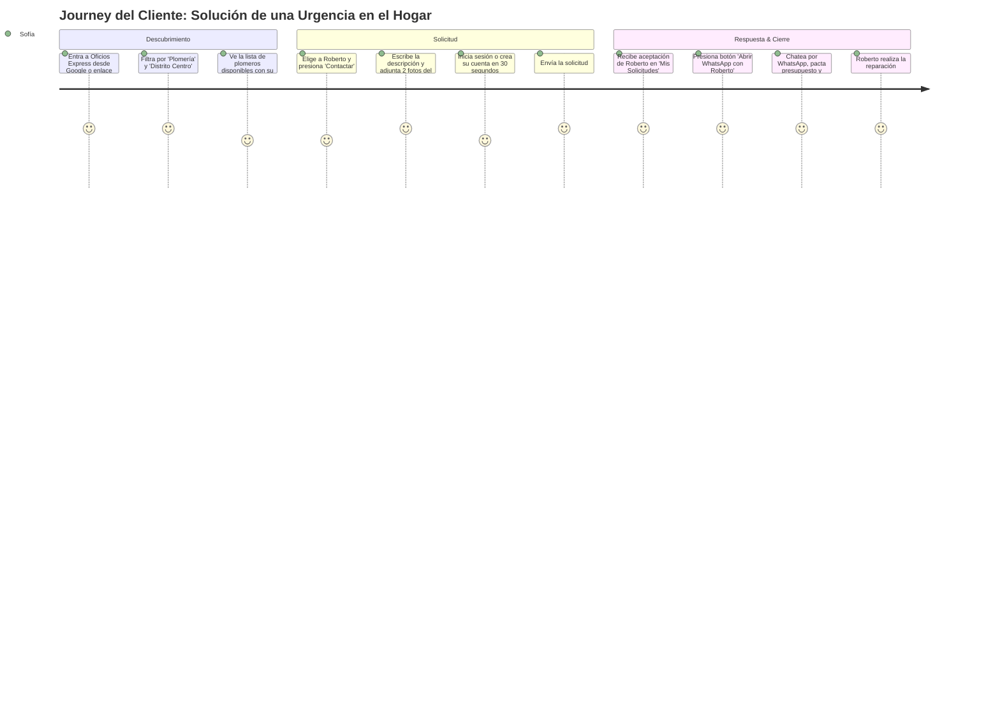
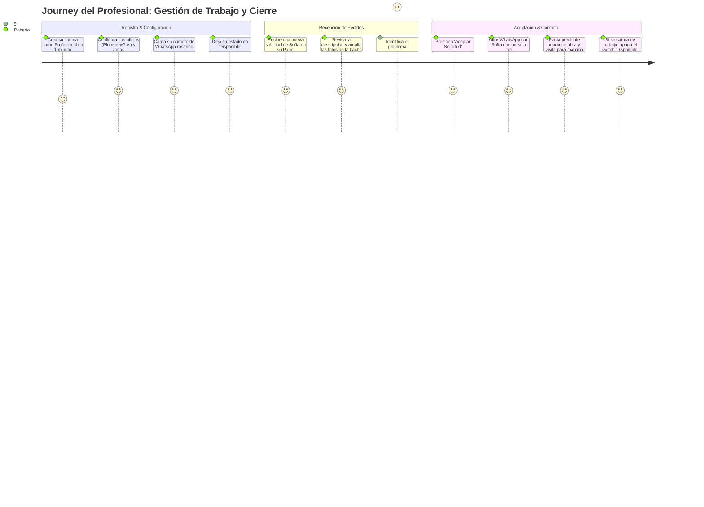

# 02 — User Personas y Customer Journey Maps

## 1. Arquetipos de Usuarios (User Personas)

### Persona 1: El Cliente Hogareño / Vecina de Rosario
- **Nombre ficticio**: Sofía Martínez
- **Edad / Ocupación**: 34 años, Empleada administrativa y madre de un hijo.
- **Ubicación**: Vive en un departamento en Distrito Centro (calle Oroño y San Juan, Rosario).
- **Contexto**: Regresa del trabajo a las 18:30 y descubre que el bajo mesada de la cocina está goteando y mojando el mueble. No conoce a ningún plomero que trabaje en el Centro y teme llamar a un desconocido sin referencias.
- **Frustraciones**:
  - *"Le pregunto al portero o en el grupo de WhatsApp del edificio y nadie responde o me pasan el contacto de alguien que vive en zona sur y no viene al centro"*.
  - *"Llamo y me dicen 'te aviso cuando pase', sin fecha cierta"*.
  - *"No sé explicar técnicamente lo que pasa por teléfono"*.
- **Objetivos con Oficios Express**:
  - Entrar rápido desde su celular.
  - Ver quién está disponible cerca de su zona hoy.
  - Sacar una foto con el celular y enviársela directamente para que el profesional vea la pérdida real.
  - Coordinar la visita rápidamente por WhatsApp.

---

### Persona 2: El Profesional de Oficio Independiente
- **Nombre ficticio**: Roberto Gómez
- **Edad / Ocupación**: 48 años, Gasista matriculado y Plomero independiente.
- **Ubicación**: Taller en Distrito Norte (Arroyito), pero atiende habitualmente Distrito Centro y Norte.
- **Contexto**: Tiene 15 años de oficio. Trabaja con su camioneta utilitaria y un teléfono Samsung con WhatsApp. Su principal fuente de trabajo era el boca a boca, pero los períodos de baja actividad le generan baches económicos.
- **Frustraciones**:
  - *"A veces voy a un domicilio al otro lado de Rosario solo para ver un cuerito de canilla y pierdo 2 horas de viaje y nafta"*.
  - *"Los clientes me llaman mientras estoy subido a una escalera soldando un caño; no puedo atender llamadas largas"*.
  - *"Otras aplicaciones de Buenos Aires me querían cobrar una fortuna por comprar créditos para responder presupuestos que después no salían"*.
- **Objetivos con Oficios Express**:
  - Recibir pedidos con fotos para saber qué repuestos comprar antes de salir.
  - Trabajar en los distritos que a él le quedan cómodos (Centro y Norte).
  - Pausar la disponibilidad cuando está con una obra grande o tapado de trabajo.
  - Hablar directamente con el cliente por WhatsApp para pactar el horario.

---

## 2. Customer Journey Map: Sofía (Cliente)

---

## 3. Customer Journey Map: Roberto (Profesional)

---

## 4. Puntos de Fricción Identificados y Mitigaciones en el Producto

| Punto Crítico | Riesgo de Abandono | Mitigación Implementada en Oficios Express |
|---|---|---|
| **Exigir registro antes de buscar** | 60% de abandono de visitantes | El catálogo es 100% abierto y público sin login. |
| **Formulario extenso o confuso** | Frustración del usuario móvil | Solo 3 campos: oficio, descripción y fotos opcionales. |
| **Formatos de WhatsApp incompatibles** | Enlace roto en Argentina (`wa.me`) | Sanitización automática con prefijo `549` para números de Rosario (`341`). |
| **Profesionales ausentes o inactivos** | Clientes sin respuesta | Switch de disponibilidad `isActive` para ocultar automáticamente a los no disponibles del catálogo. |
| **Imágenes muy pesadas en datos móviles** | Timeout en subida | Límite estricto de 3 fotos y 5MB, compresión en backend. |
