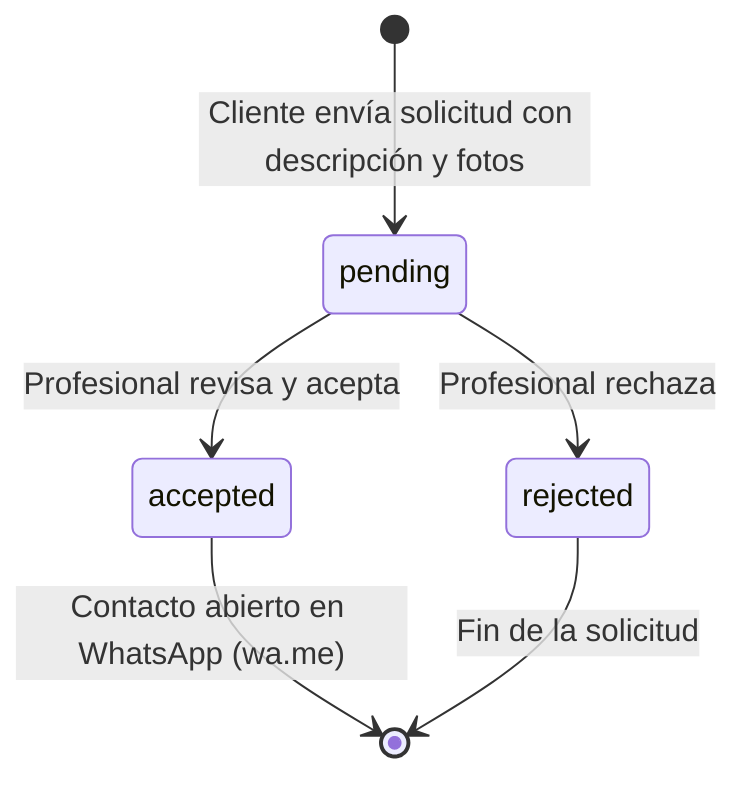

# 03 — Especificaciones Funcionales y Reglas de Negocio

## 1. Módulos Funcionales del Sistema

La plataforma Oficios Express se divide en cuatro módulos esenciales:
1. **Módulo 1: Catálogo y Búsqueda Pública**
2. **Módulo 2: Gestión de Solicitudes de Contacto y Multimedia**
3. **Módulo 3: Panel y Perfil del Profesional**
4. **Módulo 4: Autenticación, Sesiones y Seguridad**

---

## 2. Historias de Usuario con Criterios de Aceptación (Formato Gherkin)

### HU-01: Búsqueda y Filtrado en el Catálogo
**Como** usuario vecino de Rosario,  
**Quiero** filtrar a los profesionales por oficio y distrito municipal,  
**Para** encontrar rápidamente a quién me convenga cerca de mi hogar.

```gherkin
Escenario: Filtrado combinado de oficio y distrito
  Dado que estoy en la página principal "/"
  Cuando selecciono el oficio "Plomería"
  Y selecciono la zona "Distrito Centro"
  Entonces la lista debe mostrar únicamente profesionales activos que realicen "Plomería" y cubran "Distrito Centro"
  Y cada tarjeta debe mostrar el nombre, oficio principal, zonas y badge de "Disponible ahora".

Escenario: Sin resultados coincidentes
  Dado que selecciono un oficio o zona sin profesionales disponibles
  Entonces la pantalla debe mostrar un mensaje amigable indicando que no hay profesionales disponibles en esa zona con opción de restablecer los filtros.
```

---

### HU-02: Envío de Solicitud con Fotografías
**Como** cliente registrado o nuevo usuario,  
**Quiero** enviar un pedido de trabajo a un profesional con descripción y fotos,  
**Para** que evalúe el arreglo y se ponga en contacto conmigo.

```gherkin
Escenario: Envío exitoso de solicitud estando autenticado
  Dado que he iniciado sesión como cliente
  Y estoy en la página de perfil público de un profesional "/profesionales/:id"
  Cuando elijo el oficio correspondiente de la lista del profesional
  Y escribo una descripción de al menos 10 caracteres
  Y adjunto hasta 3 fotografías (archivos JPG/PNG menores a 5MB cada uno)
  Y presiono "Enviar Solicitud"
  Entonces las imágenes se suben al servidor mediante "/api/upload"
  Y se crea un registro "ContactRequest" con estado "pending"
  Y el sistema me redirige a "/mis-solicitudes" mostrando un mensaje de éxito.

Escenario: Intento de auto-solicitud (Profesional a sí mismo)
  Dado que un profesional ha iniciado sesión con su cuenta
  Cuando intenta enviar una solicitud a su propio perfil profesional
  Entonces el sistema rechaza la acción con el error "No podés enviarte una solicitud a vos mismo".

Escenario: Usuario no autenticado intenta enviar solicitud
  Dado que un visitante no autenticado completa el formulario de solicitud
  Cuando presiona "Enviar Solicitud"
  Entonces el sistema solicita inicio de sesión o registro preservando el contexto.
```

---

### HU-03: Gestión de Solicitudes por el Profesional
**Como** profesional de oficios,  
**Quiero** revisar las solicitudes entrantes y aceptarlas o rechazarlas,  
**Para** seleccionar los trabajos que puedo tomar y abrir el chat de WhatsApp con el cliente.

```gherkin
Escenario: Aceptar una solicitud entrante
  Dado que he iniciado sesión como profesional
  Y estoy en "/panel/solicitudes"
  Cuando presiono "Aceptar Solicitud" en un pedido con estado "pending"
  Entonces el estado de la solicitud cambia inmediatamente a "accepted"
  Y aparece el botón verde "Abrir WhatsApp con [Nombre del Cliente]"
  Y el cliente en su vista "/mis-solicitudes" ve el estado "Aceptada" y el botón para contactar al profesional.

Escenario: Rechazar una solicitud
  Dado que estoy en "/panel/solicitudes"
  Cuando presiono "Rechazar"
  Entonces el estado de la solicitud cambia a "rejected"
  Y la solicitud se archiva visualmente con badge rojo indicando rechazo.
```

---

### HU-04: Control de Disponibilidad del Profesional
**Como** profesional que tiene exceso de trabajo o está de vacaciones,  
**Quiero** pausar temporalmente mi disponibilidad con un interruptor,  
**Para** no recibir nuevas solicitudes ni molestar a los clientes.

```gherkin
Escenario: Pausar perfil
  Dado que estoy en "/panel/perfil" o "/panel/solicitudes"
  Cuando desactivo el switch "Disponible para recibir trabajos"
  Entonces el atributo "isActive" de mi perfil pasa a ser falso
  Y mi perfil desaparece automáticamente del catálogo público "/"
  Y los clientes que intenten ingresar directamente a mi perfil verán un aviso de "No disponible temporalmente".
```

---

## 3. Máquina de Estados de la Solicitud (State Machine)



### Reglas de Transición de Estados:
- **pending**: Estado inicial al crearse. Solo visible en bandeja de pendientes del profesional y en "Mis Solicitudes" del cliente.
- **accepted**: Solo puede ser activado por el profesional destinatario. Habilita los botones de WhatsApp bidireccionales. No puede volver a pending.
- **rejected**: Cierra la solicitud. No habilita el contacto comercial.

---

## 4. Normalización y Formato de Enlaces a WhatsApp

Para garantizar la compatibilidad con el sistema de telefonía argentino y rosarino:
1. **Regla de Formateo**:
   - Todo número de Rosario debe expresarse en formato internacional E.164: Código de país `54` + Prefijo móvil `9` + Código de área Rosario `341` + Número local (ej. `5493416445566`).
2. **Generación de la URL**:
   - `https://wa.me/{numero_sanitizado}?text={mensaje_predefinido_urlencoded}`
3. **Plantilla de Mensaje Inicial**:
   - *"Hola [Nombre], te contacto desde Oficios Express por la solicitud sobre [Oficio]."*
