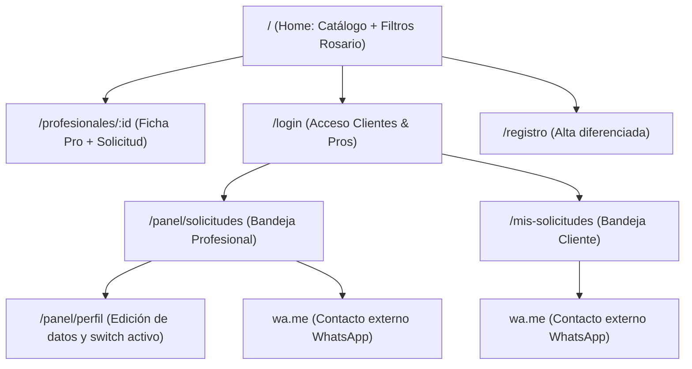

# 04 — UX/UI y Arquitectura de Información

## 1. Arquitectura de Información y Mapa del Sitio (Sitemap)



---

## 2. Sistema de Diseño y Tokens Visuales

La interfaz está construida con **Tailwind CSS v4** con una paleta orientada a la sobriedad, confianza y alta legibilidad bajo luz solar en dispositivos móviles:

### Paleta Cromática y Significado Semántico
- **Azul Primario (Brand Primary)**: `blue-600` (`#2563EB`) a `blue-700` (`#1D4ED8`) — Transmite confianza, solidez profesional y calma en situaciones de emergencia hogareña.
- **Verde WhatsApp (Action Primary)**: `emerald-600` (`#059669`) / `green-500` — Reservado estrictamente para acciones de éxito y el botón de conexión directa con WhatsApp.
- **Amarillo/Ámbar (Warning/Pending)**: `amber-500` (`#F59E0B`) — Representa estados pendientes de revisión.
- **Rojo/Destructivo**: `red-500` (`#EF4444`) — Rechazos o eliminación de cuenta.
- **Neutros y Fondos**: `slate-50` (`#F8FAFC`) de fondo para evitar fatiga visual; tarjetas en blanco puro (`#FFFFFF`) con bordes sutiles `border-slate-200` y sombras suaves `shadow-sm`.

### Tipografía y Ergonomía Táctil
- Fuente sans-serif nativa de alto rendimiento del sistema operativo.
- **Botones y Touch Targets**: Mínimo de 44x44 píxeles para garantizar que un profesional con dedos manchados o un cliente nervioso puedan pulsar sin error.
- **Campos de formulario**: Inputs de altura `h-11` (44px) con `text-base` (16px) para evitar el zoom automático no deseado en iOS Safari al enfocar inputs.

---

## 3. Wireframes Textuales de Pantallas Clave

### A. Pantalla Principal: Catálogo `/`
```
+-------------------------------------------------------------+
| [Logo: Oficios Express Rosario]          [Iniciar Sesión]   |
+-------------------------------------------------------------+
| 🔍 ¿Qué arreglo necesitás hoy en Rosario?                   |
| [ Oficio: Plomería v ]   [ Zona: Distrito Centro v ]        |
+-------------------------------------------------------------+
| Profesionales disponibles en Rosario (5)                    |
|                                                             |
| +---------------------------------------------------------+ |
| | Roberto Gómez              ● Disponible ahora           | |
| | Plomería, Gas              Distrito Centro, Norte       | |
| | "Gasista matriculado y plomero con más de 15 años de...| |
| |                                   [ Ver y Contactar > ] | |
| +---------------------------------------------------------+ |
|                                                             |
| +---------------------------------------------------------+ |
| | Carlos Fernández           ● Disponible ahora           | |
| | Electricidad               Distrito Centro, Oeste       | |
| |                                   [ Ver y Contactar > ] | |
| +---------------------------------------------------------+ |
+-------------------------------------------------------------+
```

### B. Ficha del Profesional y Formulario de Solicitud `/profesionales/:id`
```
+-------------------------------------------------------------+
| [< Volver al catálogo]                  Oficios Express     |
+-------------------------------------------------------------+
| Roberto Gómez                            ● Disponible       |
| Plomero y Gasista Matriculado - Rosario                     |
| Zonas de cobertura: Distrito Centro, Distrito Norte         |
|                                                             |
| "Especialista en fugas, cambio de griferías y calderas..."  |
+-------------------------------------------------------------+
| 📋 Solicitar contacto a Roberto                             |
|                                                             |
| Oficio solicitado:                                          |
| [* Plomería (seleccionar)]                                  |
|                                                             |
| ¿Qué problema tenés? (Sé lo más descriptivo posible):       |
| [ Tengo una pérdida constante bajo la bacha de la cocina...]|
|                                                             |
| Adjuntar fotos (opcional, máx 3 fotos de 5MB):              |
| [ + Subir fotos ]  [ bacha1.jpg x ]  [ caño.jpg x ]         |
|                                                             |
| [       Enviar Solicitud al Profesional       ]             |
+-------------------------------------------------------------+
```

### C. Bandeja del Profesional `/panel/solicitudes`
```
+-------------------------------------------------------------+
| [Logo] Panel Profesional             [Disponibilidad: ON]   |
+-------------------------------------------------------------+
| Solicitudes Recibidas (1 pendiente)                         |
|                                                             |
| +---------------------------------------------------------+ |
| | De: Sofía Martínez (Distrito Centro)      Hace 10 min    | |
| | Rubro: Plomería                                         | |
| | Mensaje: "Tengo una pérdida constante bajo la bacha..." | |
| | Fotos: [Miniatura 1] [Miniatura 2]                      | |
| |                                                         | |
| | [   ✓ Aceptar Solicitud   ]   [   ✗ Rechazar   ]        | |
| +---------------------------------------------------------+ |
|                                                             |
| Solicitudes Aceptadas:                                      |
| +---------------------------------------------------------+ |
| | Juan Pérez — Plomería                     ● Aceptada    | |
| | [ 🟢 Abrir WhatsApp con Juan (3419876543) ]              | |
| +---------------------------------------------------------+ |
+-------------------------------------------------------------+
```

---

## 4. Heurísticas de Usabilidad Aplicadas

1. **Visibilidad del Estado del Sistema**: Badges claros de color (`pending` amarillo, `accepted` verde, `rejected` rojo) y spinners de carga durante el upload de imágenes.
2. **Coincidencia con el Mundo Real**: Vocabulario local auténtico de Rosario ("Distrito Centro", "Plomero", "Gasista", "Bacha", "Térmica") y enlace nativo a WhatsApp.
3. **Control y Libertad del Usuario**: El profesional puede apagar su disponibilidad en un toque sin tener que dar de baja su cuenta ni perder su historial.
4. **Prevención de Errores**: Desactivación del botón de envío mientras se procesa la subida de fotos; validación de tamaño y extensión antes de enviar; advertencia si un profesional intenta contactarse a sí mismo.
