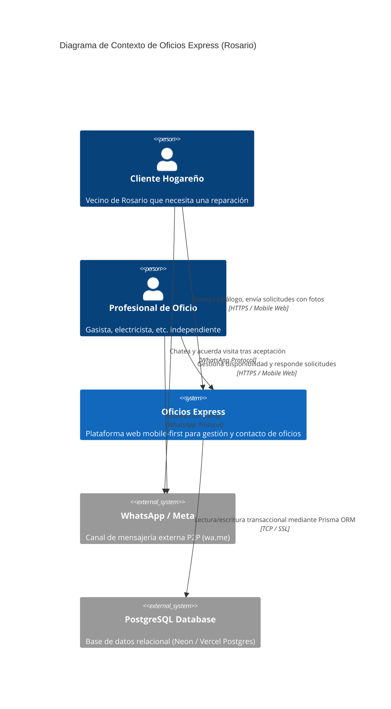
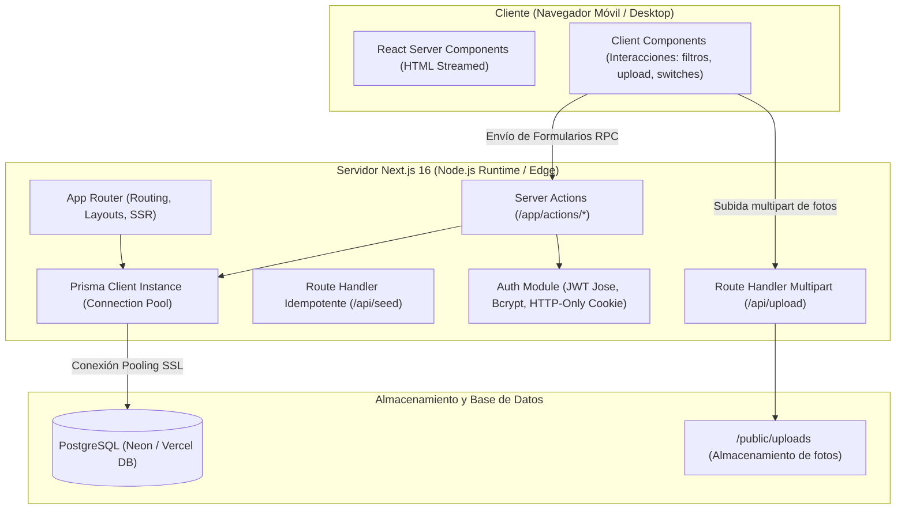

# 01 — Arquitectura del Sistema y Diseño Técnico

## 1. Visión General de la Arquitectura

**Oficios Express** implementa una arquitectura moderna de aplicación monolítica modular basada en **Next.js 16 (App Router)** y **React 19 Server Components**. La solución aprovecha el paradigma de renderizado híbrido (SSR + Streaming) con **Server Actions** para las mutaciones de datos, minimizando el envío de JavaScript al cliente y maximizando el rendimiento en conexiones móviles lentas.

### Diagrama C4: Nivel 1 — Contexto del Sistema



---

### Diagrama C4: Nivel 2 — Contenedores y Flujo de Datos



---

## 2. Decisiones de Arquitectura de Software

### ADR-01: Adopción de Next.js App Router y Server Actions
- **Contexto**: Se necesitaba un framework full-stack TypeScript de alto rendimiento que permitiera desarrollo rápido de MVP sin requerir un back-end desacoplado en Express o NestJS.
- **Decisión**: Utilizar Next.js 16 App Router con Server Actions (`"use server"`).
- **Justificación**:
  - Elimina la necesidad de escribir controladores REST boilerplate y DTOs manuales para la mayoría de las operaciones CRUD.
  - Ofrece revalidación automática de caché de ruta mediante `revalidatePath()`.
  - Mantiene la lógica de negocio y las llamadas a base de datos estrictamente en el servidor, garantizando seguridad y cero exposición de secretos.

### ADR-02: SQLite en Desarrollo Local vs PostgreSQL en Producción
- **Contexto**: El desarrollo local requiere velocidad "cero-configuración", pero la producción (Vercel) opera sobre funciones Serverless que no soportan persistencia en el sistema de archivos local para base de datos.
- **Decisión**: Soporte dual unificado con **Prisma ORM**: esquema relacional transparente, operando con SQLite en local y PostgreSQL (Neon / Vercel Postgres) en despliegue productivo.
- **Justificación**: Permite a cualquier desarrollador clonar el repo y ejecutar `npm run dev` sin levantar Docker ni configurar bases de datos remotas, mientras que en producción aprovecha la escalabilidad y pool de conexiones de Neon Postgres.

### ADR-03: Delegación de la Mensajería a WhatsApp (`wa.me`)
- **Contexto**: Construir un sistema de chat en tiempo real in-app requiere WebSockets, notificaciones push, gestión de estados de entrega y un alto costo de mantenimiento y servidores.
- **Decisión**: Usar enlaces profundos (deep links) directos a WhatsApp una vez que la solicitud es aceptada.
- **Justificación**: WhatsApp es el canal preferido por los trabajadores de oficios en Argentina; tiene 100% de tasa de apertura, costo cero de infraestructura para la plataforma y garantiza inmediatez.

---

## 3. Estructura de Directorios del Código Fuente

```
src/
├── app/                        # Capa de presentación y routing Next.js
│   ├── actions/                # Server Actions (mutaciones seguras)
│   │   ├── auth.ts             # Login, registro y logout
│   │   ├── profile.ts          # Actualización de perfil y disponibilidad pro
│   │   └── requests.ts         # Creación y transición de estados de solicitudes
│   ├── api/                    # Route Handlers para casos especiales
│   │   ├── seed/route.ts       # Endpoint de inicialización idempotente
│   │   └── upload/route.ts     # Procesamiento multipart de fotos
│   ├── login/page.tsx          # Vista de inicio de sesión
│   ├── registro/page.tsx       # Vista de alta de usuarios
│   ├── mis-solicitudes/page.tsx# Bandeja de seguimiento del cliente
│   ├── panel/
│   │   ├── solicitudes/page.tsx# Bandeja de pedidos del profesional
│   │   └── perfil/page.tsx     # Edición de perfil y zonas del profesional
│   ├── profesionales/[id]/     # Detalle público y formulario de contacto
│   ├── layout.tsx              # Shell general, viewport y navbar responsiva
│   └── page.tsx                # Home con catálogo y filtros por distrito
├── components/                 # Componentes de UI reutilizables
│   ├── ContactRequestForm.tsx  # Formulario interactivo con subida de fotos
│   ├── Navbar.tsx              # Barra de navegación adaptable según rol y sesión
│   ├── ProfessionalProfileForm.tsx # Formulario con checkboxes de oficios/distritos
│   ├── ProfessionalRequestActions.tsx # Botones de aceptar/rechazar y WhatsApp
│   ├── TradeIcon.tsx           # Renderizado dinámico de iconos Lucide
│   └── WhatsAppButton.tsx      # Generador de URL wa.me con formato Rosario
└── lib/                        # Capa de infraestructura y utilitarios
    ├── auth.ts                 # JWT con Jose, cookies HTTP-only, hashing bcrypt
    ├── constants.ts            # Listado oficial de distritos y oficios de Rosario
    ├── prisma.ts               # Singleton del cliente Prisma con detección dinámica de DB
    └── seed-data.ts            # Lógica idempotente de datos iniciales
```
