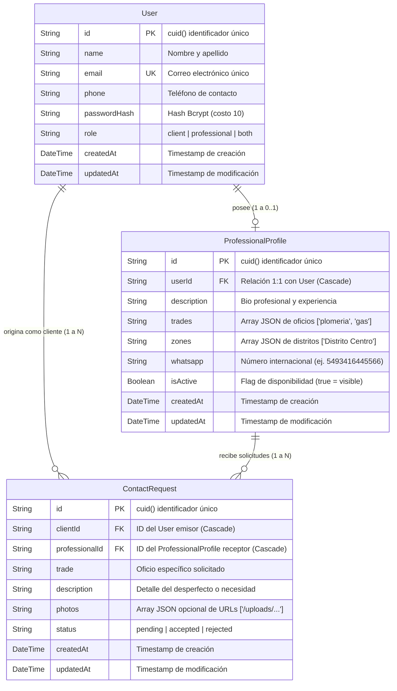

# 02 — Modelo de Datos y Base de Datos

## 1. Diagrama Entidad-Relación (ERD)



---

## 2. Diccionario de Datos Exhaustivo

### Tabla: `User`
Almacena las credenciales y datos de identidad base para todos los actores de la plataforma.

| Campo | Tipo | Nulo | Por Defecto | Descripción |
|---|---|---|---|---|
| `id` | `String` (CUID) | No | Auto `cuid()` | Identificador seguro no enumerable generado en servidor. |
| `name` | `String` | No | - | Nombre completo del usuario o profesional. |
| `email` | `String` | No | - | Dirección de correo única utilizada para autenticación. |
| `phone` | `String` | No | - | Teléfono móvil del usuario (base para WhatsApp). |
| `passwordHash` | `String` | No | - | Cadena de hash Bcrypt con 10 rondas de salt. |
| `role` | `String` | No | `"client"` | Rol del usuario (`"client"`, `"professional"` o `"both"`). |
| `createdAt` | `DateTime` | No | `now()` | Fecha y hora UTC del registro. |
| `updatedAt` | `DateTime` | No | Auto update | Fecha y hora UTC del último cambio de datos. |

---

### Tabla: `ProfessionalProfile`
Extensión de perfil para usuarios con rol profesional.

| Campo | Tipo | Nulo | Por Defecto | Descripción |
|---|---|---|---|---|
| `id` | `String` (CUID) | No | Auto `cuid()` | Identificador único del perfil profesional. |
| `userId` | `String` | No | - | Clave foránea referenciando a `User.id` (eliminación en cascada). |
| `description` | `String` (Text)| No | - | Resumen de experiencia, matrículas y especialidades. |
| `trades` | `String` (JSON)| No | - | Array serializado de IDs de oficio (ej. `["plomeria", "gas"]`). |
| `zones` | `String` (JSON)| No | - | Array serializado de distritos de Rosario cubiertos. |
| `whatsapp` | `String` | No | - | Teléfono sanitizado sin símbolos ni espacios (ej. `5493416445566`). |
| `isActive` | `Boolean` | No | `true` | Interruptor de disponibilidad. Si es `false`, se oculta de búsquedas. |
| `createdAt` | `DateTime` | No | `now()` | Fecha y hora de creación del perfil profesional. |
| `updatedAt` | `DateTime` | No | Auto update | Fecha y hora de última modificación. |

---

### Tabla: `ContactRequest`
Representa el ciclo de vida de un pedido de servicio entre un cliente y un profesional.

| Campo | Tipo | Nulo | Por Defecto | Descripción |
|---|---|---|---|---|
| `id` | `String` (CUID) | No | Auto `cuid()` | Identificador único de la solicitud. |
| `clientId` | `String` | No | - | Clave foránea al `User` que solicita el servicio. |
| `professionalId`| `String` | No | - | Clave foránea al `ProfessionalProfile` solicitado. |
| `trade` | `String` | No | - | Oficio requerido (ej. `"electricidad"`). |
| `description` | `String` (Text)| No | - | Explicación detallada del problema o trabajo a realizar. |
| `photos` | `String` (JSON)| Sí | `null` | Array serializado con rutas relativas de fotos subidas (máx 3). |
| `status` | `String` | No | `"pending"` | Estado: `"pending"` (esperando), `"accepted"`, `"rejected"`. |
| `createdAt` | `DateTime` | No | `now()` | Momento en que el cliente envió el pedido. |
| `updatedAt` | `DateTime` | No | Auto update | Momento en que el profesional aceptó o rechazó. |

---

## 3. Estrategia de Migración y Concurrencia

### Sincronización Automática en CI/CD (`prisma db push`)
- En lugar de bloquear despliegues con migraciones manuales complejas durante la fase de validación de MVP, el script `scripts/db-sync.mjs` ejecuta `prisma db push --accept-data-loss --skip-generate` durante el proceso de build en Vercel.
- Esto garantiza que cualquier evolución de modelos en `schema.prisma` se aplique automáticamente a la base de datos de Neon/PostgreSQL sin intervención humana.

### Población Idempotente (Seed)
- La función `runSeed()` implementada en `src/lib/seed-data.ts` realiza una verificación previa:
  ```typescript
  const existingUsers = await prisma.user.count();
  if (existingUsers > 0 && !force) {
    return { alreadySeeded: true };
  }
  ```
- Si la base de datos ya cuenta con datos reales de usuarios, el seed no destruye la información, preservando la integridad de producción.
